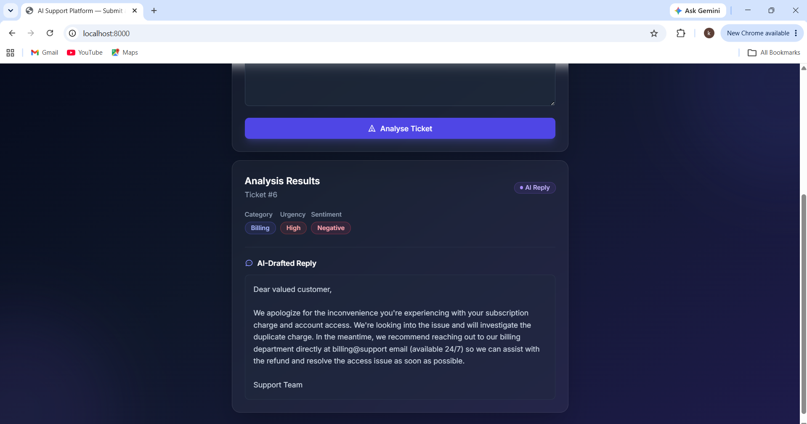

# AI-Powered Customer Support Platform

[](https://github.com/YOUR_USERNAME/ai-support-platform/actions)

A full-stack portfolio project demonstrating ML classification, NLP, REST API design, and GenAI integration — built to showcase skills for **Software Engineer, Backend, Full Stack, AI/ML, and Gen AI** roles.

---

## Problem Statement

Customer support teams are overwhelmed by unclassified tickets. This platform automatically:
1. **Classifies** each ticket into a category (Billing / Technical / Account / General)
2. **Scores urgency** (High / Medium / Low) using rule-based keyword detection
3. **Analyses sentiment** (Positive / Neutral / Negative) using VADER
4. **Drafts a reply** using Groq's `llama-3.1-8b-instant` model, with a graceful fallback if the API is unavailable

---

## Tech Stack

| Layer | Technology |
|---|---|
| Backend | FastAPI + Uvicorn |
| ML — Classification | scikit-learn (TF-IDF + Logistic Regression) |
| ML — Urgency | Rule-based keyword scoring |
| ML — Sentiment | VADER (vaderSentiment) |
| AI Reply | Groq API (`llama-3.1-8b-instant`) with static fallback |
| Database | SQLite + SQLAlchemy ORM |
| Frontend | Plain HTML + Vanilla JS + Tailwind CSS (CDN) |
| Testing | pytest + FastAPI TestClient (httpx) |
| Container | Docker (python:3.11-slim, single container) |
| CI | GitHub Actions |
| Deploy | Render (Docker web service) |

---

## Project Structure

```
ai-support-platform/
├── app/
│   ├── main.py          # FastAPI app + routes
│   ├── database.py      # SQLAlchemy + SQLite setup
│   ├── models.py        # ORM model (Ticket table)
│   ├── ai_reply.py      # Groq API integration + fallback
│   └── ml/
│       ├── classifier.py  # TF-IDF + LR pipeline
│       ├── urgency.py     # Rule-based urgency scorer
│       ├── sentiment.py   # VADER sentiment analyzer
│       └── train.py       # Training script
├── data/
│   └── tickets.csv      # 80 labeled training samples
├── models/
│   └── classifier.pkl   # Serialized trained model (committed)
├── templates/
│   └── index.html       # Single-page frontend
├── tests/
│   ├── test_classifier.py  # ML layer unit tests (15 tests)
│   └── test_api.py         # API integration tests (18 tests)
├── .env.example
├── .gitignore
├── Dockerfile
├── requirements.txt
└── .github/workflows/ci.yml
```

---

## Local Setup

### Prerequisites
- Python 3.11+
- pip

### Steps

```bash
# 1. Clone the repository
git clone https://github.com/YOUR_USERNAME/ai-support-platform.git
cd ai-support-platform

# 2. Create and activate a virtual environment
python -m venv .venv
# Windows:
.venv\Scripts\activate
# macOS/Linux:
source .venv/bin/activate

# 3. Install dependencies
pip install -r requirements.txt

# 4. Create .env from the template (then add your real key inside it)
Copy-Item .env.example .env
# Open .env in a text editor and replace:
#   GROQ_API_KEY=your_groq_api_key_here
# with your actual key from https://console.groq.com

# 5. Train the classifier (creates models/classifier.pkl)
python -m app.ml.train

# 6. Start the development server
uvicorn app.main:app --reload

# App runs at: http://localhost:8000
# API docs at: http://localhost:8000/docs
```

---

## API Reference

### `GET /health`
Basic health check.

**Response:**
```json
{ "status": "ok", "version": "1.0.0" }
```

---

### `POST /ticket`
Submit a support ticket for classification.

**Request:**
```bash
curl -X POST http://localhost:8000/ticket \
  -H "Content-Type: application/json" \
  -d '{"text": "I cannot login to my account and I need help urgently"}'
```

**Response:**
```json
{
  "id": 1,
  "text": "I cannot login to my account and I need help urgently",
  "category": "Account",
  "urgency": "High",
  "sentiment": "Negative",
  "message": "Ticket received and classified."
}
```

---

### `POST /ticket/reply`
Generate an AI-drafted reply for a previously submitted ticket.

**Request:**
```bash
curl -X POST http://localhost:8000/ticket/reply \
  -H "Content-Type: application/json" \
  -d '{"ticket_id": 1}'
```

**Response (with GROQ_API_KEY set):**
```json
{
  "ticket_id": 1,
  "reply": "Dear Customer,\n\nWe sincerely apologise for the difficulty you're experiencing accessing your account...",
  "is_ai_generated": true
}
```

**Response (without GROQ_API_KEY — fallback):**
```json
{
  "ticket_id": 1,
  "reply": "Thank you for reaching out to us. We have received your ticket...",
  "is_ai_generated": false
}
```

---

## Running Tests

```bash
pytest tests/ -v
```

Expected output: **34 passed** (18 API integration tests + 16 ML unit tests).

The test suite uses an in-memory SQLite database and does **not** require a `GROQ_API_KEY` — the fallback path is tested explicitly.

---

## Docker

```bash
# Build the image (trains the model at build time)
docker build -t ai-support-platform .

# Run the container
docker run -p 8000:8000 \
  -e GROQ_API_KEY=your_key_here \
  ai-support-platform

# App available at http://localhost:8000
```

---

## Deployment on Render

1. **Push to GitHub** — make sure your repo is public (or connect Render to your private repo).
2. **Create a new Web Service** on [render.com](https://render.com).
3. **Select "Docker"** as the environment.
4. Set the following:
   - **Build Command**: *(leave blank — Dockerfile handles everything)*
   - **Start Command**: *(leave blank — CMD in Dockerfile)*
   - **Port**: `8000`
5. **Add Environment Variable** in Render's dashboard:
   - `GROQ_API_KEY` → your Groq API key
6. Deploy — Render will build the Docker image and start the service.

> **Note**: The SQLite database is ephemeral in Docker. Data resets on each deploy. For production, add a Render Postgres instance and update `DATABASE_URL`.

---

## Screenshot



---

## Design Decisions (for interviews)

| Decision | Rationale |
|---|---|
| FastAPI over Flask | Async-ready, auto OpenAPI docs, Pydantic validation out of the box |
| TF-IDF + Logistic Regression | Interpretable, fast, no GPU needed, achieves >90% accuracy on 80 samples with bigrams |
| VADER for sentiment | Purpose-built for short informal text; pure Python, no model downloads |
| Rule-based urgency | Transparent, auditable, easy to extend without retraining |
| Groq over OpenAI | Free tier, no credit card, OpenAI-compatible — swappable in one line |
| classifier.pkl committed | Reviewers can clone and run immediately without retraining |
| Single-container Docker | Simplest possible deployment — one `docker run` starts everything |

---

## License

MIT
