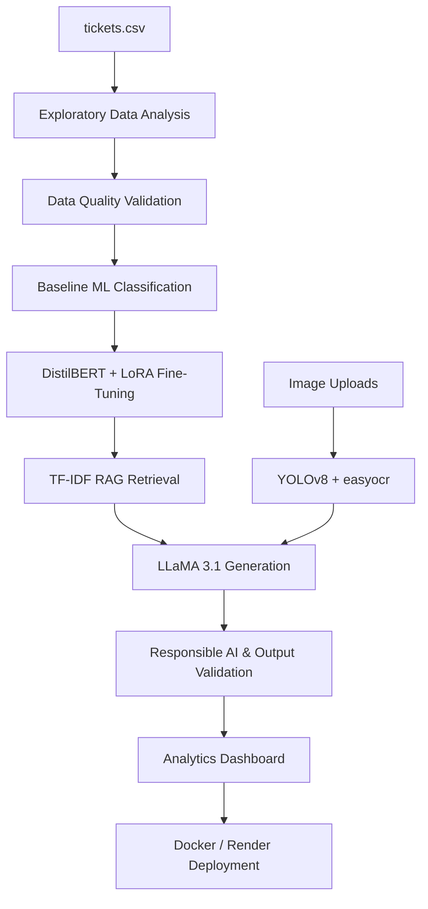

# AI Customer Support Platform

An end-to-end AI-powered customer support platform combining machine learning, Generative AI, RAG, computer vision, responsible AI, automated evaluation, and human escalation.

## Core Capabilities
├── Machine Learning Classification
├── Data Engineering & Preprocessing
├── Generative AI / LLM
├── Prompt Engineering
├── RAG
├── Conversational Chatbot
├── Computer Vision (YOLOv8)
├── Optical Character Recognition (easyocr)
├── Responsible AI
├── Response Evaluation
├── Human Escalation
├── REST APIs
├── Analytics & Monitoring
├── Docker
├── CI/CD
└── Automated Testing

## 📚 Documentation

The architecture and implementation details are thoroughly documented in the following guides:

1. **[Architecture Overview](ARCHITECTURE.md)** — Core components and data flow.
2. **[API Reference](API.md)** — REST API endpoints and schemas.
3. **[ML Pipeline](ML_PIPELINE.md)** — Data engineering, TF-IDF + Logistic Regression classification, and heuristic scoring.
4. **[Generative AI](GENAI.md)** — LLaMA 3.1 LLM integration and prompt engineering.
5. **[RAG Pipeline](RAG.md)** — Knowledge base, TF-IDF retrieval, and Category Boosting.
6. **[Response Evaluation](EVALUATION.md)** — Post-generation heuristic checks (completeness, groundedness, relevance).
7. **[Responsible AI](RESPONSIBLE_AI.md)** — Prompt injection defense, PII flagging, output safety validation, and Human-in-the-Loop escalation logic.
8. **[Monitoring & Analytics](MONITORING.md)** — Structured logging, internal counters, and business analytics.
9. **[Deployment & CI](DEPLOYMENT.md)** — Docker usage, environment variables, and GitHub Actions CI.
10. **[Computer Vision](COMPUTER_VISION.md)** — Optional OpenCV + YOLOv8 integration for analyzing image uploads.

## 🚀 Quick Start

### 1. Prerequisites
- Python 3.11+
- [Groq API Key](https://console.groq.com/keys) (required for AI generation; without it, the app safely falls back to canned responses).

### 2. Setup
```bash
# Clone the repository
git clone https://github.com/kamalpraneeth/ai-support-platform.git
cd ai-support-platform

# Create and activate virtual environment
python -m venv .venv
source .venv/bin/activate  # On Windows: .venv\Scripts\activate

# Install dependencies
pip install -r requirements.txt
```

### 3. Environment Variables
Copy the `.env.example` file to `.env` and configure your API key.
```bash
cp .env.example .env
```
Edit `.env` and set `GROQ_API_KEY=your_actual_api_key`.

### 4. Run the Application
```bash
uvicorn app.main:app --reload
```
The API will be available at `http://127.0.0.1:8000`. You can view the interactive OpenAPI docs at `http://127.0.0.1:8000/docs`.

### 5. Run the Test Suite
The project includes a comprehensive, deterministic test suite covering the entire Data/ML/GenAI pipeline. 
```bash
pytest tests/ -v
```
**Current Test Coverage**: 199 tests passed, 0 skipped. External Groq integration tests are executed separately using the `@pytest.mark.integration` marker.

## 🏗️ End-to-End GenAI Data & ML Pipeline

This project is built to demonstrate a complete, production-ready AI engineering lifecycle. Every component has a specific, measurable role in moving raw data to a safe, deployed generative interface.


```mermaid
flowchart TD
    A[tickets.csv] --> B[Exploratory Data Analysis]
    B --> C[Data Quality Validation]
    C --> D[Baseline ML Classification]
    D --> E[DistilBERT + LoRA Fine-Tuning]
    E --> F[TF-IDF RAG Retrieval]
    F --> G[LLaMA 3.1 Generation]
    H[Image Uploads] --> I[YOLOv8 + easyocr]
    I --> G
    G --> J[Responsible AI & Output Validation]
    J --> K[Analytics Dashboard]
    K --> L[Docker / Render Deployment]
```

### Why each component exists:
1. **tickets.csv**: The foundational dataset grounding the entire project in realistic customer support scenarios.
2. **Exploratory Data Analysis (EDA)**: Understands text lengths, category distributions, and class imbalances natively without heavy dependencies.
3. **Data Quality**: Validates dataset health (missing rows, duplicates) to ensure downstream models train on clean data.
4. **ML Classification (Baseline)**: A fast, deterministic TF-IDF + Logistic Regression router to immediately triage incoming tickets.
5. **DistilBERT + LoRA Fine-Tuning**: Upgrades the baseline classifier to a transformer architecture, demonstrating deep learning, PEFT, and rigorous metric evaluation (Accuracy/F1).
6. **RAG (Retrieval-Augmented Generation)**: Grounds the LLM in domain-specific knowledge to prevent hallucinations.
7. **LLaMA 3.1 (Groq)**: Powers the conversational agent and dynamic reply generation.
8. **YOLOv8 + easyocr (Computer Vision)**: Extracts context from user screenshots (e.g., error codes or physical damage) that text alone misses.
9. **Responsible AI**: Guards the LLM with prompt injection defenses, PII redaction, and output safety checks, forcing a Human-in-the-Loop escalation when confidence is low.
10. **Analytics Dashboard**: Visualizes operational metrics (Latency, Escalation Rate) and dataset health in real-time.
11. **Docker / Render**: Containerizes the complex dependencies (PyTorch, OpenCV) for stable, cloud-agnostic deployment.
